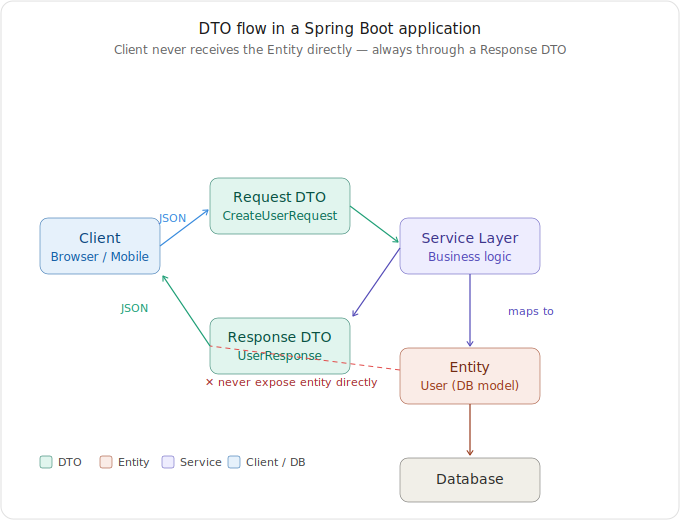

# Data Transfer Object (DTO) — Spring Boot Notes

> **What is a DTO?**
> A Data Transfer Object is a plain Java object whose only job is to carry data between layers of your application. No business logic. No database annotations. No behavior — just fields and accessors.

---

## Why DTO?

Your internal database `Entity` often contains:
- Sensitive fields (`passwordHash`, `internalScore`)
- JPA/MongoDB persistence annotations irrelevant to the client
- Lazily-loaded relations that can cause N+1 queries if serialized directly

The DTO is your **controlled, intentional API contract** — you decide exactly what goes in and what stays out.

---

## Flow Diagram



> The client always talks to a DTO — never to the Entity directly.
> - **Request DTO** → carries client input into the service layer
> - **Response DTO** → carries processed output back to the client
> - **Entity** → stays inside the server, mapped to/from DTOs in the service layer

---

## Implementation: Spring Data JPA

### The Entity (never expose this directly)

```java
@Entity
@Table(name = "users")
public class User {
    @Id
    @GeneratedValue(strategy = GenerationType.IDENTITY)
    private Long id;

    private String username;
    private String email;
    private String passwordHash;   // sensitive — never leave the server
    private String internalRole;   // internal — client doesn't need this
    private LocalDateTime createdAt;

    // getters, setters
}
```

### Request DTO (client → server)

```java
// No @Entity, no JPA annotations — just a plain Java class
public class CreateUserRequest {

    @NotBlank
    private String username;

    @Email
    @NotBlank
    private String email;

    @Size(min = 8)
    private String password;  // raw password comes in; hash it in the service

    // getters, setters
}
```

### Response DTO (server → client)

```java
public class UserResponse {
    private Long id;
    private String username;
    private String email;
    private LocalDateTime createdAt;
    // passwordHash intentionally omitted
}
```

### Service Layer (mapping happens here)

```java
@Service
@RequiredArgsConstructor
public class UserService {

    private final UserRepository userRepository;
    private final PasswordEncoder passwordEncoder;

    public UserResponse createUser(CreateUserRequest request) {

        // Map Request DTO → Entity
        User user = new User();
        user.setUsername(request.getUsername());
        user.setEmail(request.getEmail());
        user.setPasswordHash(passwordEncoder.encode(request.getPassword()));
        user.setCreatedAt(LocalDateTime.now());

        User saved = userRepository.save(user);

        // Map Entity → Response DTO
        UserResponse response = new UserResponse();
        response.setId(saved.getId());
        response.setUsername(saved.getUsername());
        response.setEmail(saved.getEmail());
        response.setCreatedAt(saved.getCreatedAt());
        return response;
    }
}
```

### Controller (thin — just delegates)

```java
@RestController
@RequestMapping("/api/users")
@RequiredArgsConstructor
public class UserController {

    private final UserService userService;

    @PostMapping
    public ResponseEntity<UserResponse> create(@RequestBody @Valid CreateUserRequest request) {
        UserResponse response = userService.createUser(request);
        return ResponseEntity.status(HttpStatus.CREATED).body(response);
    }
}
```

---

## Implementation: Spring Data MongoDB

Same concept, different annotations. MongoDB documents use `@Document` instead of `@Entity`, and IDs are `String` (ObjectId) instead of `Long`.

### MongoDB Document (Entity equivalent)

```java
@Document(collection = "products")
public class Product {
    @Id
    private String id;           // MongoDB uses String IDs (ObjectId)

    private String name;
    private String description;
    private double price;
    private double costPrice;    // internal — never expose to clients
    private String supplierId;   // internal — irrelevant to clients
    private boolean active;

    // getters, setters
}
```

### Request DTO

```java
public class CreateProductRequest {

    @NotBlank
    private String name;

    private String description;

    @Positive
    private double price;
    // costPrice and supplierId are omitted — only internal staff set those
}
```

### Response DTO

```java
public class ProductResponse {
    private String id;
    private String name;
    private String description;
    private double price;
    // costPrice intentionally omitted
}
```

### Service Layer

```java
@Service
@RequiredArgsConstructor
public class ProductService {

    private final ProductRepository productRepository;

    public ProductResponse createProduct(CreateProductRequest request) {

        // Map Request DTO → Document
        Product product = new Product();
        product.setName(request.getName());
        product.setDescription(request.getDescription());
        product.setPrice(request.getPrice());
        product.setActive(true);

        Product saved = productRepository.save(product);

        // Map Document → Response DTO
        ProductResponse response = new ProductResponse();
        response.setId(saved.getId());
        response.setName(saved.getName());
        response.setDescription(saved.getDescription());
        response.setPrice(saved.getPrice());
        return response;
    }
}
```

---

## Practical Tips

### Use MapStruct to eliminate manual mapping boilerplate

MapStruct generates the mapping code at **compile time** — zero reflection, zero runtime overhead.

```java
@Mapper(componentModel = "spring")
public interface UserMapper {
    UserResponse toResponse(User user);
    User toEntity(CreateUserRequest request);
}
```

Inject and use in service:

```java
@Service
@RequiredArgsConstructor
public class UserService {
    private final UserRepository userRepository;
    private final UserMapper userMapper;

    public UserResponse createUser(CreateUserRequest request) {
        User user = userMapper.toEntity(request);
        User saved = userRepository.save(user);
        return userMapper.toResponse(saved);
    }
}
```

### Use Java Records for read-only Response DTOs (Java 16+)

Immutable, concise, no Lombok needed:

```java
public record UserResponse(Long id, String username, String email, LocalDateTime createdAt) {}
```

### Validation belongs on the Request DTO, not the Entity

The Entity's job is persistence integrity. The DTO's job is API contract validation.

```java
// Correct — validation on the DTO
public class CreateUserRequest {
    @NotBlank(message = "Username cannot be blank")
    @Size(min = 3, max = 50)
    private String username;

    @Email
    @NotBlank
    private String email;
}

// Wrong — don't duplicate validation annotations on the Entity
@Entity
public class User {
    // @NotBlank here is redundant and confusing
    private String username;
}
```

---

## Common Mistakes & Anti-Patterns

### ❌ Returning the Entity directly from the Controller

```java
// BAD — exposes passwordHash, internalRole, JPA proxy state
@GetMapping("/{id}")
public User getUser(@PathVariable Long id) {
    return userRepository.findById(id).orElseThrow();
}
```

```java
// GOOD — client gets exactly what it needs
@GetMapping("/{id}")
public UserResponse getUser(@PathVariable Long id) {
    return userService.getUserById(id);
}
```

---

### ❌ Using the same DTO for both Request and Response

```java
// BAD — forces you to expose fields you don't want (id, createdAt)
// and accept fields from the client you shouldn't (id)
public class UserDTO {
    private Long id;
    private String username;
    private String email;
    private String passwordHash;
    private LocalDateTime createdAt;
}
```

Request and Response DTOs evolve independently. Always keep them separate.

---

### ❌ Putting business logic inside a DTO

```java
// BAD — DTOs should be dumb data carriers
public class OrderDTO {
    private List<ItemDTO> items;

    public double calculateTotal() {  // logic does NOT belong here
        return items.stream().mapToDouble(ItemDTO::getPrice).sum();
    }
}
```

```java
// GOOD — calculation lives in the Service
@Service
public class OrderService {
    public double calculateTotal(List<Item> items) {
        return items.stream().mapToDouble(Item::getPrice).sum();
    }
}
```

---

### ❌ Mapping inside the Controller

```java
// BAD — controller is now doing two jobs
@PostMapping
public ResponseEntity<UserResponse> create(@RequestBody CreateUserRequest request) {
    User user = new User();
    user.setUsername(request.getUsername());  // mapping should not be here
    // ...
    userRepository.save(user);
    return ResponseEntity.ok(new UserResponse(...));
}
```

```java
// GOOD — controller just delegates; mapping is the service's job
@PostMapping
public ResponseEntity<UserResponse> create(@RequestBody @Valid CreateUserRequest request) {
    return ResponseEntity.status(HttpStatus.CREATED).body(userService.createUser(request));
}
```

---

### ❌ Forgetting `@Valid` in the Controller

Without `@Valid`, your `@NotBlank`, `@Email`, `@Size` annotations on the Request DTO are silently ignored.

```java
// BAD — validation annotations on CreateUserRequest are never triggered
public ResponseEntity<UserResponse> create(@RequestBody CreateUserRequest request) { }

// GOOD
public ResponseEntity<UserResponse> create(@RequestBody @Valid CreateUserRequest request) { }
```

---

### ❌ JPA: Triggering lazy-loaded relations during serialization

```java
// BAD — if User has @OneToMany(fetch = LAZY) List<Order> orders,
// Jackson will try to serialize it, triggering N+1 DB queries
@GetMapping("/{id}")
public User getUser(@PathVariable Long id) {
    return userRepository.findById(id).orElseThrow();
}
```

Using a Response DTO eliminates this entirely — you only populate the fields you explicitly choose.

---

## JPA vs MongoDB: Key DTO Differences

| Concern | Spring Data JPA | Spring Data MongoDB |
|---|---|---|
| Entity annotation | `@Entity` + `@Table` | `@Document(collection = "...")` |
| ID type | `Long` (auto-increment) | `String` (ObjectId) |
| ID generation | `@GeneratedValue` | Assigned by MongoDB driver |
| Lazy-loading risk | Yes — triggers N+1 if entity serialized | No lazy loading; embedded docs serialize eagerly |
| Nested data | Relations via `@OneToMany`, `@ManyToOne` | Embedded documents in the same JSON |
| DTO purpose | Same — control what leaves the server | Same — also used to reshape/flatten embedded docs |

---

## Quick Reference

```
Client
  │  JSON (Request DTO)
  ▼
Controller  ──@Valid──►  Request DTO
  │
  ▼
Service Layer
  ├── Request DTO  ──maps to──►  Entity / Document
  ├── Saves to DB via Repository
  └── Entity ──maps to──►  Response DTO
  │
  ▼
Controller  ──►  Response DTO (JSON)
  │
  ▼
Client
```

---

*Notes compiled while learning Spring Boot — covers DTO with Spring Data JPA and Spring Data MongoDB.*
