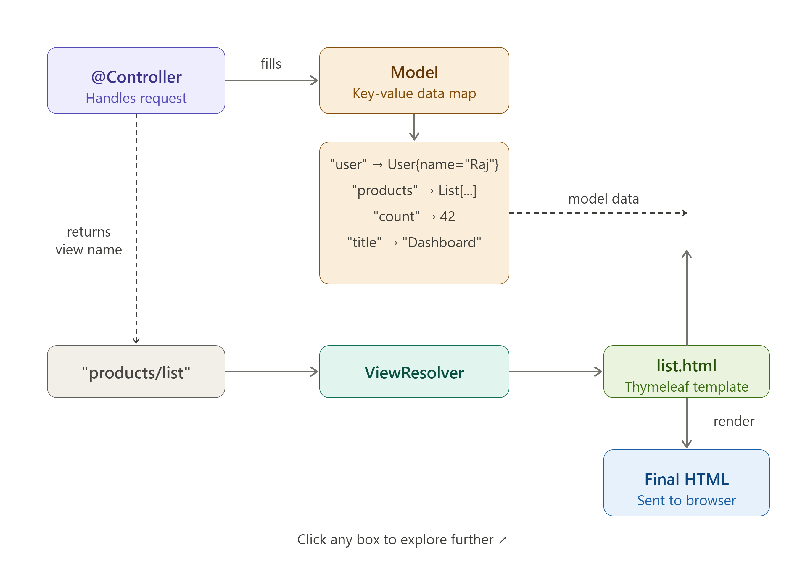

# Spring MVC — Model and View

## Table of Contents
- [The Flow Diagram](#the-flow-diagram)
- [What is MVC?](#what-is-mvc)
- [The Model](#the-model)
- [The View](#the-view)
- [ModelAndView](#modelandview)
- [Model vs ModelMap vs ModelAndView](#model-vs-modelmap-vs-modelandview)
- [Return Values from a Controller](#return-values-from-a-controller)
- [Common Mistakes](#common-mistakes)
- [The Golden Rule](#the-golden-rule)

---

## The Flow Diagram

```
 Browser
    │
    │  HTTP Request (GET /products)
    ▼
 DispatcherServlet          ◄──── Front Controller (entry point for all requests)
    │
    │  "Who handles this URL?"
    ▼
 HandlerMapping              ◄──── Finds the right @Controller method
    │
    │  Returns handler
    ▼
 @Controller                 ◄──── Your code runs here
    │  fills Model with data
    │  returns view name ("products/list")
    ▼
 Model                       ◄──── Key-value map: { "products" → [...], "title" → "All" }
    │
    ▼
 ViewResolver                ◄──── Maps "products/list" → templates/products/list.html
    │
    ▼
 View (JSP / Thymeleaf)      ◄──── Merges Model data into the HTML template
    │
    │  Final HTML
    ▼
 Browser
```
## Flow Diagram


---

## What is MVC?

MVC stands for **Model-View-Controller** — a design pattern that splits an app into three clear responsibilities.

| Layer | Responsibility | Spring Component |
|---|---|---|
| Model | Holds the data to display | `Model`, `ModelMap`, `ModelAndView` |
| View | Renders the data as HTML | JSP / Thymeleaf template file |
| Controller | Handles the request, fills Model, picks View | `@Controller` class |

**Simple analogy:**
- **Model** = the data (a list of products, a user object)
- **View** = the HTML page that displays it
- **Controller** = the middleman that fetches data and hands it to the page

---

## The Model

`Model` is just a **key-value map** you fill in your controller. The View reads from it by key name.

### Basic usage

```java
@Controller
public class ProductController {

    @GetMapping("/products")
    public String list(Model model) {

        List<Product> products = productService.findAll();

        model.addAttribute("products", products);   // key = "products"
        model.addAttribute("count", products.size()); // key = "count"
        model.addAttribute("title", "All Products");  // key = "title"

        return "products/list";  // go render this view
    }
}
```

The View then accesses `${products}`, `${count}`, `${title}` by those exact key names.

### Adding different data types

```java
model.addAttribute("username", "Raj");           // String
model.addAttribute("age", 25);                   // int
model.addAttribute("isAdmin", true);             // boolean
model.addAttribute("products", productList);     // List<Product>
model.addAttribute("user", userObject);          // custom object
model.addAttribute("scores", new int[]{10,20});  // array
```

### Useful Model methods

```java
model.addAttribute("key", value);         // add one entry
model.addAllAttributes(someMap);          // add all entries from a Map
model.containsAttribute("key");           // check if a key exists → boolean
model.asMap();                            // get the whole map as Map<String, Object>
```

---

## The View

The View is the **HTML template file** that Spring renders using the data from the Model.

### Where view files live

When your controller returns `"products/list"`, Spring looks for:

```
src/main/resources/templates/products/list.html   ← Thymeleaf
src/main/webapp/WEB-INF/views/products/list.jsp   ← JSP
```

This prefix/suffix is configured in `application.properties`:

```properties
# For JSP
spring.mvc.view.prefix=/WEB-INF/views/
spring.mvc.view.suffix=.jsp
```

### Simple JSP example

```jsp
<!-- /WEB-INF/views/products/list.jsp -->
<%@ page contentType="text/html;charset=UTF-8" %>
<%@ taglib uri="http://java.sun.com/jsp/jstl/core" prefix="c" %>

<html>
<head><title>${title}</title></head>
<body>

  <h1>${title}</h1>

  <!-- Loop over the list -->
  <ul>
    <c:forEach var="product" items="${products}">
      <li>${product.name} — ${product.price}</li>
    </c:forEach>
  </ul>

  <!-- Show total count -->
  <p>Total: ${count} products</p>

</body>
</html>
```

The `${...}` syntax reads data straight from the Model by key name.

### Simple Thymeleaf example

```html
<!-- templates/products/list.html -->
<html>
<body>
  <h1 th:text="${title}">Title</h1>

  <ul>
    <li th:each="p : ${products}" th:text="${p.name}">Product</li>
  </ul>

  <p>Total: <span th:text="${count}">0</span> products</p>
</body>
</html>
```

---

## ModelAndView

Instead of returning a `String` and filling a `Model` separately, `ModelAndView` bundles both together.

```java
@GetMapping("/profile")
public ModelAndView profile() {

    ModelAndView mav = new ModelAndView();

    mav.setViewName("profile");            // set the view name
    mav.addObject("user", currentUser);    // add model data
    mav.addObject("posts", userPosts);     // add more data

    return mav;  // return both at once
}
```

This is **exactly equivalent** to:

```java
@GetMapping("/profile")
public String profile(Model model) {
    model.addAttribute("user", currentUser);
    model.addAttribute("posts", userPosts);
    return "profile";
}
```

Both do the same thing. `ModelAndView` is more common in older codebases.

---

## Model vs ModelMap vs ModelAndView

All three do the same job — pass data from controller to view.

```java
// Option 1: Model  (interface) — simplest and most common
@GetMapping("/a")
public String pageA(Model model) {
    model.addAttribute("msg", "Hello");
    return "viewA";
}

// Option 2: ModelMap  (class, extends LinkedHashMap)
@GetMapping("/b")
public String pageB(ModelMap map) {
    map.addAttribute("msg", "Hello");  // same as Model
    map.put("count", 10);             // Map methods also work
    return "viewB";
}

// Option 3: ModelAndView  (model + view name in one object)
@GetMapping("/c")
public ModelAndView pageC() {
    ModelAndView mav = new ModelAndView("viewC");
    mav.addObject("msg", "Hello");
    return mav;
}
```

### Which one to use?

| Option | Use when |
|---|---|
| `Model` | Default — clean and simple, use this most of the time |
| `ModelMap` | You need Map-specific methods like `putAll()` or `containsKey()` |
| `ModelAndView` | You want to set the view name and data together in one object |

---

## Return Values from a Controller

```java
// Render a view
return "dashboard";

// Render a view in a subfolder
return "products/list";

// Redirect (sends HTTP 302 to browser, browser makes a new GET request)
return "redirect:/products";

// Forward (server-side — stays in same request, URL doesn't change in browser)
return "forward:/products";
```

### Passing data through a redirect

Model attributes are **lost** on redirect. Use `RedirectAttributes` instead:

```java
// ❌ Wrong — "msg" will be lost after redirect
@PostMapping("/save")
public String save(Model model) {
    model.addAttribute("msg", "Saved!");
    return "redirect:/home";
}

// ✅ Correct — use RedirectAttributes (flash attribute survives one redirect)
@PostMapping("/save")
public String save(RedirectAttributes ra) {
    ra.addFlashAttribute("msg", "Saved!");
    return "redirect:/home";
}
```

---

## Common Mistakes

### 1. Wrong view name

```java
// File is at templates/products/list.html
return "list";           // ❌ Spring can't find it
return "products/list";  // ✅ correct
```

### 2. Wrong key name in the view

```java
// Controller adds with key "productList"
model.addAttribute("productList", products);
```
```html
<!-- View uses wrong key "products" -->
<c:forEach var="p" items="${products}">    ❌
<c:forEach var="p" items="${productList}"> ✅
```

### 3. Using Model in @RestController

```java
@RestController   // ❌ @RestController writes JSON — views are never rendered
public String page(Model model) { ... }

@Controller       // ✅ use @Controller when you want to render views
public String page(Model model) { ... }
```

### 4. Expecting model data to survive a redirect

```java
model.addAttribute("msg", "Done!");
return "redirect:/home";  // ❌ model data is gone — use RedirectAttributes
```

---

## The Golden Rule

> **Controllers should never build HTML.**
> **Views should never fetch data.**
>
> The Model is the clean handoff point between them.
