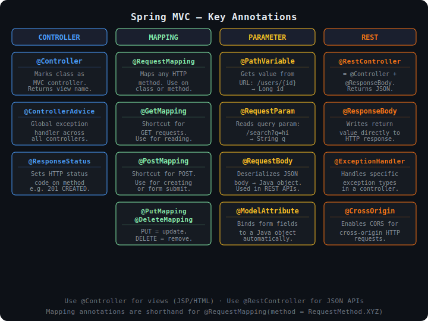

# Spring Web MVC — Notes

## Table of Contents
- [What is Spring Web MVC?](#what-is-spring-web-mvc)
- [Request Lifecycle Flow](#request-lifecycle-flow)
- [Key Annotations](#key-annotations)
- [Setting Up a Controller](#setting-up-a-controller)
- [The Model](#the-model)
- [The View (JSP)](#the-view-jsp)
- [ModelAndView](#modelandview)
- [Model vs ModelMap vs ModelAndView](#model-vs-modelmap-vs-modelandview)
- [Handling Forms with JSP](#handling-forms-with-jsp)
- [Return Values from a Controller](#return-values-from-a-controller)
- [Exception Handling](#exception-handling)
- [Common Mistakes](#common-mistakes)
- [The Golden Rule](#the-golden-rule)

---

## What is Spring Web MVC?

Spring Web MVC is a web framework built on the **Model-View-Controller** pattern and the Java Servlet API. It gives you a clean, annotation-driven way to handle HTTP requests.

| Layer | Responsibility | Spring Component |
|---|---|---|
| Model | Holds the data to display | `Model`, `ModelMap`, `ModelAndView` |
| View | Renders the data as HTML | JSP file |
| Controller | Handles requests, fills Model, picks View | `@Controller` class |

A single **DispatcherServlet** receives every HTTP request and routes it to the right controller method.

---

## Request Lifecycle Flow


**Step-by-step:**

1. Browser sends `GET /products`
2. `DispatcherServlet` receives the request (the single entry point)
3. `HandlerMapping` scans registered controllers and finds the right method
4. Your `@Controller` method runs — calls the service, fills the Model, returns a view name
5. `ViewResolver` maps the view name → physical `.jsp` file
6. JSP merges Model data into HTML and sends the final response back to the browser

---

## Key Annotations



### Quick summary

| Annotation | Purpose |
|---|---|
| `@Controller` | Marks a class as an MVC controller (returns view names) |
| `@RestController` | Like `@Controller` but returns JSON directly (no view) |
| `@RequestMapping` | Maps a URL path to a class or method |
| `@GetMapping` | Shortcut for `@RequestMapping(method = GET)` |
| `@PostMapping` | Shortcut for `@RequestMapping(method = POST)` |
| `@PutMapping` | Shortcut for PUT (update) |
| `@DeleteMapping` | Shortcut for DELETE (remove) |
| `@PathVariable` | Reads a value from the URL path: `/users/{id}` |
| `@RequestParam` | Reads a query parameter: `/search?q=hello` |
| `@RequestBody` | Deserializes JSON request body into a Java object |
| `@ModelAttribute` | Binds form fields to a Java object automatically |
| `@ResponseBody` | Writes return value directly to the HTTP response |
| `@ResponseStatus` | Sets the HTTP status code on a method |
| `@ExceptionHandler` | Handles a specific exception inside a controller |
| `@ControllerAdvice` | Global exception handler across all controllers |

---

## Setting Up a Controller

### Maven dependency

```xml
<dependency>
    <groupId>org.springframework.boot</groupId>
    <artifactId>spring-boot-starter-web</artifactId>
</dependency>
```

### JSP support (add to pom.xml)

```xml
<dependency>
    <groupId>org.apache.tomcat.embed</groupId>
    <artifactId>tomcat-embed-jasper</artifactId>
</dependency>
<dependency>
    <groupId>jakarta.servlet.jsp.jstl</groupId>
    <artifactId>jakarta.servlet.jsp.jstl-api</artifactId>
</dependency>
```

### application.properties

```properties
spring.mvc.view.prefix=/WEB-INF/views/
spring.mvc.view.suffix=.jsp
```

### Basic controller

```java
@Controller
@RequestMapping("/products")
public class ProductController {

    @Autowired
    private ProductService productService;

    // GET /products
    @GetMapping
    public String list(Model model) {
        model.addAttribute("products", productService.findAll());
        model.addAttribute("title", "All Products");
        return "products/list";   // → /WEB-INF/views/products/list.jsp
    }

    // GET /products/42
    @GetMapping("/{id}")
    public String detail(@PathVariable Long id, Model model) {
        model.addAttribute("product", productService.findById(id));
        return "products/detail";
    }

    // POST /products
    @PostMapping
    public String save(@ModelAttribute Product product) {
        productService.save(product);
        return "redirect:/products";
    }
}
```

---

## The Model

`Model` is a **key-value map** your controller fills with data. The JSP view reads from it using the same key names.

### Adding data

```java
@GetMapping("/dashboard")
public String dashboard(Model model) {
    model.addAttribute("username", "Raj");            // String
    model.addAttribute("orderCount", 42);             // int
    model.addAttribute("isAdmin", true);              // boolean
    model.addAttribute("products", productList);      // List<Product>
    model.addAttribute("user", userObject);           // custom object
    return "dashboard";
}
```

### Useful Model methods

```java
model.addAttribute("key", value);        // add one entry
model.addAllAttributes(someMap);         // add all entries from a Map
model.containsAttribute("key");          // check if a key exists → boolean
model.asMap();                           // get the whole map as Map<String, Object>
```

---

## The View (JSP)

The View is the **JSP file** that Spring renders using the data from the Model.

### File location

When your controller returns `"products/list"`, Spring looks for:

```
src/main/webapp/WEB-INF/views/products/list.jsp
```

### JSP example — list page

```jsp
<%@ page contentType="text/html;charset=UTF-8" %>
<%@ taglib uri="http://java.sun.com/jsp/jstl/core" prefix="c" %>

<html>
<head><title>${title}</title></head>
<body>

  <h1>${title}</h1>

  <table border="1">
    <tr>
      <th>Name</th>
      <th>Price</th>
      <th>Action</th>
    </tr>
    <c:forEach var="product" items="${products}">
      <tr>
        <td>${product.name}</td>
        <td>${product.price}</td>
        <td><a href="/products/${product.id}">View</a></td>
      </tr>
    </c:forEach>
  </table>

  <p>Total: ${products.size()} products</p>

</body>
</html>
```

### JSP example — detail page

```jsp
<%@ page contentType="text/html;charset=UTF-8" %>

<html>
<head><title>${product.name}</title></head>
<body>

  <h1>${product.name}</h1>
  <p>Price: ${product.price}</p>
  <p>Stock: ${product.stock}</p>

  <a href="/products">Back to list</a>

</body>
</html>
```

### `${...}` reads directly from the Model

```jsp
${title}              <%-- model.addAttribute("title", "...") --%>
${user.name}          <%-- model.addAttribute("user", userObj) — accesses getName() --%>
${products.size()}    <%-- call methods on model objects --%>
```

---

## ModelAndView

Bundles the Model data and the view name into one object instead of using them separately.

```java
@GetMapping("/profile")
public ModelAndView profile() {
    ModelAndView mav = new ModelAndView();

    mav.setViewName("profile");           // the view (maps to profile.jsp)
    mav.addObject("user", currentUser);   // model data
    mav.addObject("posts", userPosts);

    return mav;
}
```

This is exactly equivalent to:

```java
@GetMapping("/profile")
public String profile(Model model) {
    model.addAttribute("user", currentUser);
    model.addAttribute("posts", userPosts);
    return "profile";
}
```

Both produce the same result. `ModelAndView` is more common in older codebases.

---

## Model vs ModelMap vs ModelAndView

All three pass data from controller to view. Pick whichever fits your style.

```java
// Option 1: Model — simplest, most common
@GetMapping("/a")
public String pageA(Model model) {
    model.addAttribute("msg", "Hello");
    return "viewA";
}

// Option 2: ModelMap — same as Model but is a class (Map methods available)
@GetMapping("/b")
public String pageB(ModelMap map) {
    map.addAttribute("msg", "Hello");
    map.put("count", 10);          // Map.put() also works
    return "viewB";
}

// Option 3: ModelAndView — model + view name together
@GetMapping("/c")
public ModelAndView pageC() {
    ModelAndView mav = new ModelAndView("viewC");
    mav.addObject("msg", "Hello");
    return mav;
}
```

| Option | Use when |
|---|---|
| `Model` | Default — clean and simple |
| `ModelMap` | You need Map methods like `putAll()` or `containsKey()` |
| `ModelAndView` | You want to set the view name and data in one object |

---

## Handling Forms with JSP

### The JSP form

```jsp
<%@ page contentType="text/html;charset=UTF-8" %>

<html>
<head><title>Add Product</title></head>
<body>

  <h1>Add Product</h1>

  <form action="/products" method="post">
    <label>Name: <input type="text" name="name"/></label><br/>
    <label>Price: <input type="text" name="price"/></label><br/>
    <button type="submit">Save</button>
  </form>

</body>
</html>
```

### The Controller

```java
// Show the form
@GetMapping("/products/new")
public String showForm() {
    return "products/form";
}

// Handle form submit
@PostMapping("/products")
public String saveProduct(@ModelAttribute Product product) {
    // Spring binds form fields to Product object automatically:
    // name="name"  → product.setName(...)
    // name="price" → product.setPrice(...)
    productService.save(product);
    return "redirect:/products";
}
```

### The Product class (must have getters/setters)

```java
public class Product {
    private String name;
    private double price;

    // getters and setters
    public String getName() { return name; }
    public void setName(String name) { this.name = name; }
    public double getPrice() { return price; }
    public void setPrice(double price) { this.price = price; }
}
```

---

## Return Values from a Controller

```java
// Render a JSP view
return "dashboard";

// Render a view inside a subfolder
return "products/list";       // → /WEB-INF/views/products/list.jsp

// HTTP 302 redirect — browser makes a new GET request
return "redirect:/products";

// Server-side forward — stays in same request, URL doesn't change
return "forward:/products";
```

### Passing data through a redirect

Model attributes are **lost** after a redirect. Use `RedirectAttributes`:

```java
// Wrong — "msg" will be lost after redirect
@PostMapping("/save")
public String save(Model model) {
    model.addAttribute("msg", "Saved!");
    return "redirect:/home";        // model data gone here
}

// Correct — flash attribute survives one redirect
@PostMapping("/save")
public String save(RedirectAttributes ra) {
    ra.addFlashAttribute("msg", "Saved!");
    return "redirect:/home";
}
```

Then read it in the JSP on `/home`:

```jsp
<c:if test="${not empty msg}">
    <p>${msg}</p>
</c:if>
```

---

## Exception Handling

### Local — inside one controller

```java
@Controller
public class ProductController {

    @ExceptionHandler(ProductNotFoundException.class)
    public String handleNotFound(ProductNotFoundException ex, Model model) {
        model.addAttribute("error", ex.getMessage());
        return "error/404";     // → /WEB-INF/views/error/404.jsp
    }
}
```

### Global — across all controllers

```java
@ControllerAdvice
public class GlobalExceptionHandler {

    @ExceptionHandler(ResourceNotFoundException.class)
    @ResponseStatus(HttpStatus.NOT_FOUND)
    public String handleNotFound(ResourceNotFoundException ex, Model model) {
        model.addAttribute("message", ex.getMessage());
        return "error/404";
    }

    @ExceptionHandler(Exception.class)
    @ResponseStatus(HttpStatus.INTERNAL_SERVER_ERROR)
    public String handleGeneral(Exception ex, Model model) {
        model.addAttribute("message", "Something went wrong");
        return "error/500";
    }
}
```

---

## Common Mistakes

### 1. Wrong view name

```java
// JSP is at /WEB-INF/views/products/list.jsp
return "list";            // wrong — Spring can't find it
return "products/list";   // correct
```

### 2. Wrong key name in JSP

```java
model.addAttribute("productList", products);   // key = "productList"
```
```jsp
<c:forEach var="p" items="${products}">    <%-- wrong key --%>
<c:forEach var="p" items="${productList}"> <%-- correct --%>
```

### 3. Using Model in @RestController

```java
@RestController   // wrong — @RestController writes JSON, views are never rendered
public String page(Model model) { ... }

@Controller       // correct — use @Controller for JSP views
public String page(Model model) { ... }
```

### 4. Model data lost after redirect

```java
model.addAttribute("msg", "Done!");
return "redirect:/home";   // wrong — use RedirectAttributes instead
```

### 5. Missing JSTL taglib declaration in JSP

```jsp
<%-- Without this, <c:forEach> will not work --%>
<%@ taglib uri="http://java.sun.com/jsp/jstl/core" prefix="c" %>
```

---

## The Golden Rule

> **Controllers should never build HTML.**
> **Views should never fetch data.**
>
> The Model is the clean handoff point between them.
